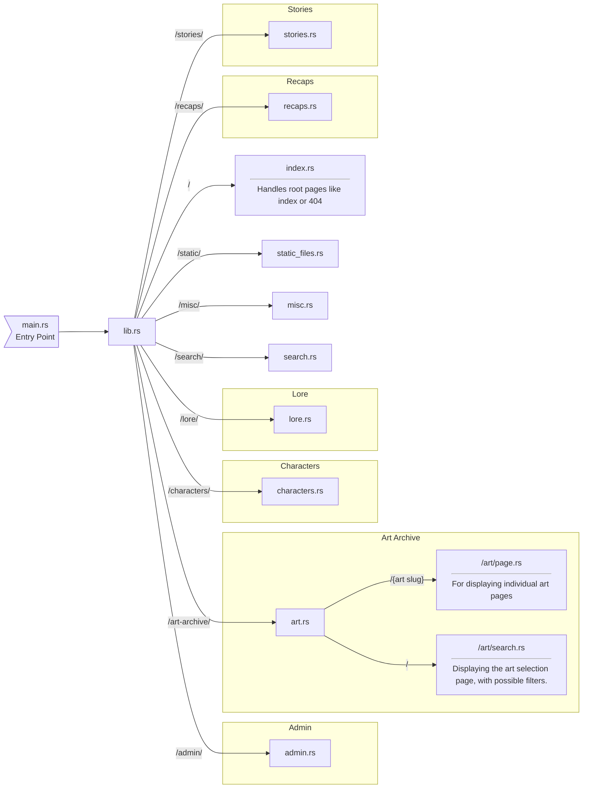

# Code Structure

A proposed code structure for the rust code that's going to be running the backend.

This code's going to be working on cloudflare's infrastructure, including

- **Workers**, which spin up an instance of the code per request. (Meaning I probably should avoid in-memory caching or anything that relies on a given instance being spun up)
- **D1**, an SQLite database
- **R2**, a persistent storage database

----

## Code Graph

### Considerations

- How do I handle NSFW art index? Is it its own url, or just a cookie?
