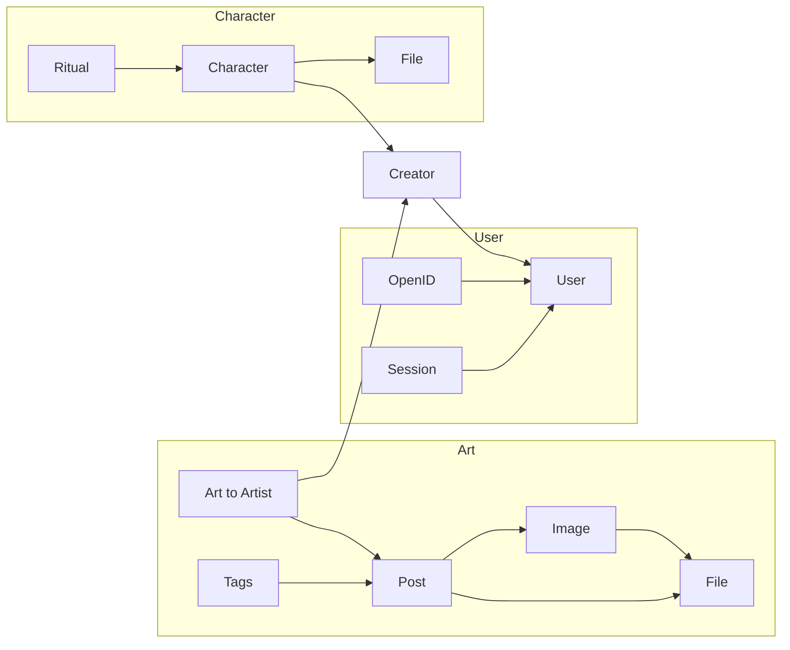

# Server Infrastructure

This is the current format I think would be good for the server, before I start working on it.

---

## Code

TODO

---

## Databases

The databases will be mostly SQLite tables stored on Cloudflare's D1 service, and partially file hosting databases on the R2 service.



---

### User

The user databases will consist of the following:

- **User DB,** holding the info regarding the users registered to the site.
- **OpenID DB,** holding the indentifiers for each user on various OpenID protocols I implemented for login. (Initially just github or discord, but making it a table already to not bite it later.)
- **Session DB,** holding the current sessions of each user.

The User DB will include the following columns:

```sql
    ID int NOT NULL PRIMARY KEY,
    Username varchar(30) NOT NULL,
```

The OpenID DB will include the following columns:

```sql
    TokenIssuer varchar(255? /*how long?*/) NOT NULL,
    IssuerUserID varchar(255?) NOT NULL,
    LocalUserID int NOT NULL FOREIGN KEY REFERENCES User(ID),
```

#### Considerations

- What else do we want users to be able to store about themselves?

### Art

The art databases will consist of the following:

- **Post DB,** holding the metadata that's 1:1 for each post. Title, thumbnail, etc.
- **Tag DB,** holding the tags of each post.
- **File DB,** holding the img/video files of the posts.
- **Image DB,** holding links *to* the File DB, connecting it to the relevant post from Post DB.
- **ArtToArtist DB,** holding foreign keys from Post DB and Creator DB, connecting art with artist. (This will allow searching art by artist, and having more than one artist per art piece.)

The Post database will include the following columns:

```sql
ID int NOT NULL PRIMARY KEY,
Title varchar(255) NOT NULL,
Slug varchar(255) NOT NULL, -- The slug to reach this art: /art-archive/[slug]
Thumbnail tinytext NOT NULL, -- References a File DB url
CreationDate date NOT NULL,
LastEditDate timestamp NOT NULL, -- SHOULD NOT BE EDITABLE TO USERS!! default is CreationDate.
Format enum(IMAGE, VIDEO) NOT NULL, -- I think I should change this. This does not play well with everything else. Maybe just set the format based on the contents of the urls? Whether they're .png or .mov or anything?
PostedBy int FOREIGN KEY REFERENCES User(ID) -- Nullable. Null means it's from the [static site to webapp import process].

```

The Tags database will be another D1 table, this one exclusively holding the tags of each art piece.

```sql
ID int NOT NULL PRIMARY KEY,
Tag varchar(64) NOT NULL,
BelongsTo int NOT NULL FOREIGN KEY REFERENCES Post(ID)
```

The File database will be a R2 Cloudflare database. They allow up to 10GB for free per month which is very nice.

ArtToArtist will associate the items in Post with their creators.

```sql
PostID int NOT NULL FOREIGN KEY REFERENCES Post(ID)
Creator varchar(255) NOT NULL FOREIGN KEY REFERENCES Creator(Username)
```

#### Considerations

- What's the max length we expect a title to be? It shouldn't be too long for useability. Right now it's 255 just for the sake of it.
- How can we make sure this db will handle emojis and special characters appropriately?

### Creator

An SQL table representing the authors, artists, etc who contribute to the site.

```sql
Username varchar(255) NOT NULL PRIMARY KEY
```

### Character

The Character databases will consist of the following:

- **Character DB**, an sql table with data on the various characters.
- **Ritual DB**, an sql table with ritual-relevant data on the characters who this applies to.
- **File DB**, holding the various image associated with the characters.

The columns of Character DB will be:

```sql
ID int NOT NULL PRIMARY KEY,
ShortName varchar(12) NOT NULL,
Thumbnail tinytext NOT NULL, -- References an File DB url
Creator varchar(255) FOREIGN KEY REFERENCES Creator(Username),
PageContents LONGTEXT,
CharacterTag varchar(255), 
-- TODO: Fill in all the stupid details I allowed in character pages until now
```

TODO: Write down the ritual-related stuff.

#### Considerations

- Is storing all the page text as one big value a good idea? I won't ever need it outside of the context of loading the page, so there aren't any modularity issues to worry about.
