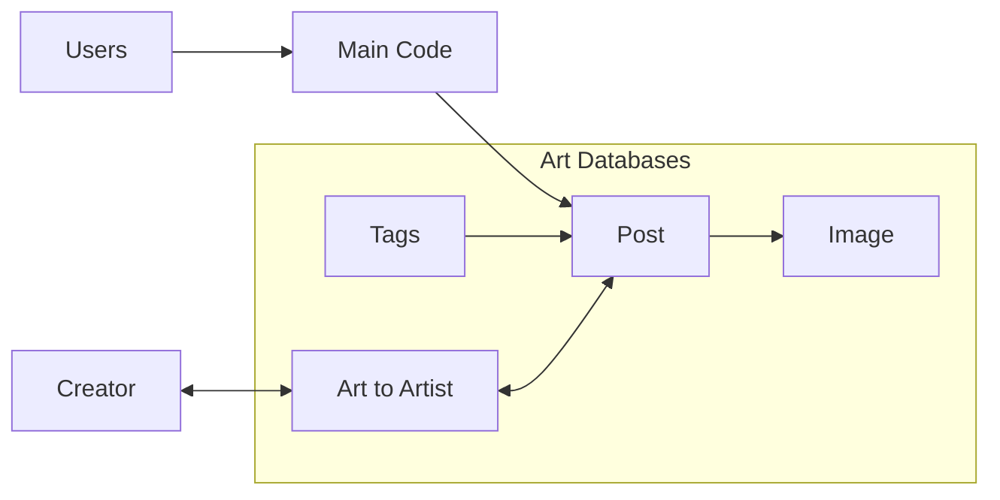

# Server Infrastructure

This is the current format I think would be good for the server, before I start working on it.



## Art Databases

The art databases will consist of several databases:

- **Post DB,** holding the metadata that's 1:1 for each post. Title, thumbnail, etc.
- **Tag DB,** holding the tags of each post.
- **File DB,** holding the img/video files of the posts.
- **Image DB,** holding links *to* the File DB, connecting it to the relevant post from Post DB.
- **ArtToArtist DB,** holding foreign keys from Post DB and Creator DB, connecting art with artist. (This will allow searching art by artist, and having more than one artist per art piece.)

The Post database will be an SQLite table run on Cloudflare's D1 infrastructure, with the following columns:

```sql
ID int NOT NULL PRIMARY KEY,
Title varchar(255) NOT NULL,
Thumbnail tinytext NOT NULL, -- References a File DB url
CreationDate date NOT NULL,
LastEditDate timestamp NOT NULL, -- SHOULD NOT BE EDITABLE TO USERS!!
Format enum(IMAGE, VIDEO) NOT NULL -- I think I should change this. This does not play well with everything else. Maybe just set the format based on the contents of the urls? Whether they're .png or .mov or anything?

```

The Tags database will be another D1 table, this one exclusively holding the tags of each art piece.

The File database will be a R2 Cloudflare database. They allow up to 10GB for free per month which is very nice.

TODO!

### Considerations

- What's the max length we expect a title to be? It shouldn't be too long for useability. Right now it's 255 just for the sake of it.
- How can we make sure this db will handle emojis and special characters appropriately?

## Creators

This is a D1 SQLite table representing the authors, artists, etc who contribute to the site.

### Considerations

- Should we be able to connect users to Creators? 